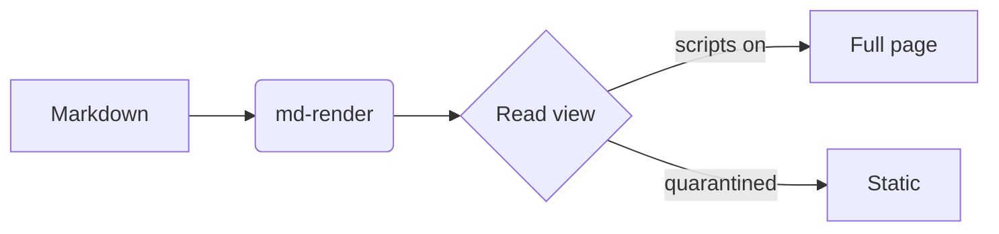
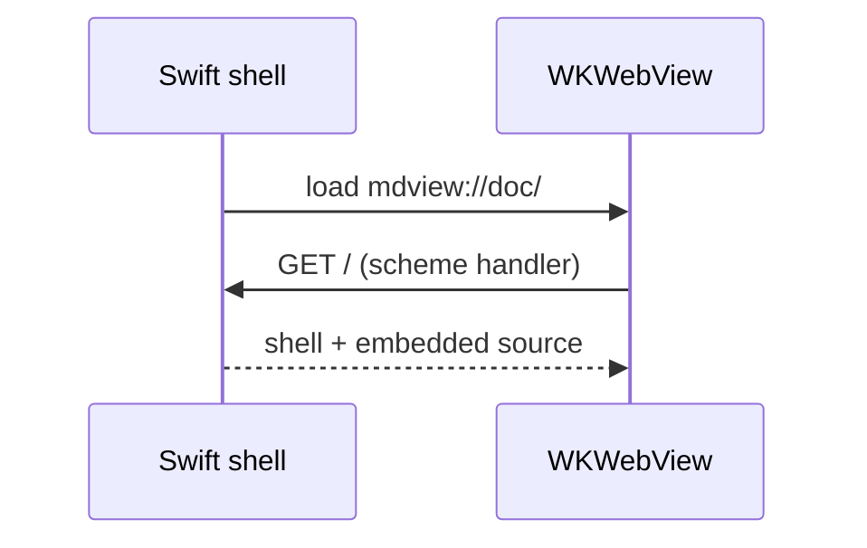
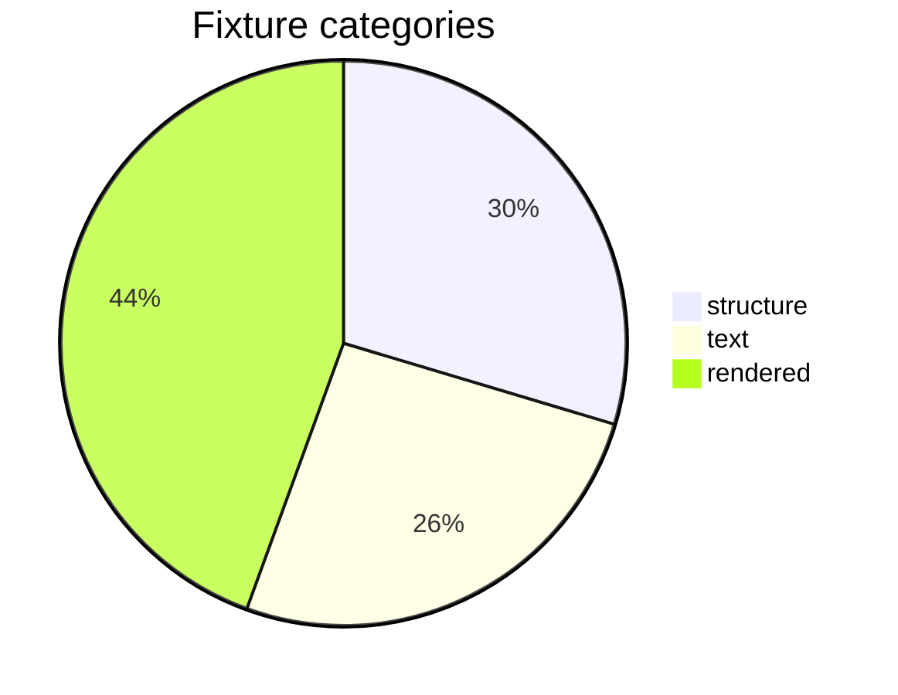

# Mermaid

```mermaid
flowchart LR
  A[Markdown] --> B(md-render)
  B --> C{Read view}
  C -->|scripts on| D[Full page]
  C -->|quarantined| E[Static]
```

A sequence diagram:

```mermaid
sequenceDiagram
  participant S as Swift shell
  participant W as WKWebView
  S->>W: load mdview://doc/
  W->>S: GET / (scheme handler)
  S-->>W: shell + embedded source
```

A pie chart:

```mermaid
pie title Fixture categories
  "structure" : 8
  "text" : 7
  "rendered" : 12
```

A diagram with a syntax error renders an error message, not a blank:

```mermaid
flowchart LR
  A --> 
```

Text after the diagrams.
